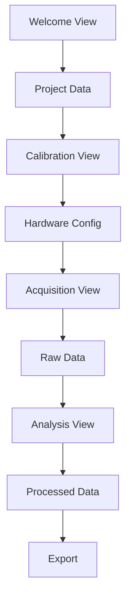

# 🚀 Suggestions d'Améliorations Détaillées - CHNeoWave v1.0.0

**Date:** 21 Juillet 2025  
**Architecte Logiciel en Chef (ALC)**  
**Statut:** ✅ Application fonctionnelle - Améliorations recommandées

## 📋 Résumé Exécutif

Suite à l'analyse approfondie du code CHNeoWave, voici mes recommandations spécifiques pour améliorer la qualité, la maintenabilité et la robustesse de l'application. Ces suggestions sont classées par priorité et impact.

## 🎯 Améliorations Prioritaires

### 1. 🔒 Validation et Sécurité des Données

#### Problème Identifié
Le code manque de validation stricte des entrées utilisateur, particulièrement dans les vues de projet et de configuration.

#### Solution Recommandée
```python
# Créer un module de validation centralisé
# src/hrneowave/core/validators.py

from typing import Any, Dict, List, Optional
from dataclasses import dataclass
from enum import Enum

class ValidationLevel(Enum):
    WARNING = "warning"
    ERROR = "error"
    CRITICAL = "critical"

@dataclass
class ValidationResult:
    is_valid: bool
    level: ValidationLevel
    message: str
    field: Optional[str] = None

class ProjectValidator:
    """Validateur pour les données de projet"""
    
    @staticmethod
    def validate_project_name(name: str) -> ValidationResult:
        if not name or len(name.strip()) < 3:
            return ValidationResult(
                False, ValidationLevel.ERROR,
                "Le nom du projet doit contenir au moins 3 caractères",
                "project_name"
            )
        
        if len(name) > 100:
            return ValidationResult(
                False, ValidationLevel.ERROR,
                "Le nom du projet ne peut pas dépasser 100 caractères",
                "project_name"
            )
        
        # Vérifier les caractères interdits
        forbidden_chars = ['<', '>', ':', '"', '|', '?', '*']
        if any(char in name for char in forbidden_chars):
            return ValidationResult(
                False, ValidationLevel.ERROR,
                f"Le nom du projet contient des caractères interdits: {forbidden_chars}",
                "project_name"
            )
        
        return ValidationResult(True, ValidationLevel.WARNING, "Nom valide")
    
    @staticmethod
    def validate_laboratory(lab: str) -> ValidationResult:
        if not lab or len(lab.strip()) < 2:
            return ValidationResult(
                False, ValidationLevel.ERROR,
                "Le nom du laboratoire doit contenir au moins 2 caractères",
                "laboratory"
            )
        return ValidationResult(True, ValidationLevel.WARNING, "Laboratoire valide")
```

#### Intégration dans les Vues
```python
# Dans welcome_view.py - Ajouter validation en temps réel

def _on_project_name_changed(self):
    """Validation en temps réel du nom de projet"""
    name = self.project_name.text()
    result = ProjectValidator.validate_project_name(name)
    
    if not result.is_valid:
        self.project_name.setStyleSheet("border: 2px solid red;")
        self.show_validation_error(result.message)
    else:
        self.project_name.setStyleSheet("")
        self.clear_validation_error()
    
    self._update_validate_button_state()
```

### 2. 🛡️ Gestion d'Erreurs Robuste

#### Problème Identifié
La gestion d'erreurs est inconsistante et manque de contexte pour le débogage.

#### Solution Recommandée
```python
# src/hrneowave/core/error_handler.py

import traceback
import logging
from typing import Optional, Dict, Any
from datetime import datetime
from pathlib import Path

class ErrorContext:
    """Contexte d'erreur enrichi"""
    
    def __init__(self, operation: str, component: str, user_data: Optional[Dict] = None):
        self.operation = operation
        self.component = component
        self.user_data = user_data or {}
        self.timestamp = datetime.now()
        self.stack_trace = traceback.format_stack()
    
    def to_dict(self) -> Dict[str, Any]:
        return {
            'operation': self.operation,
            'component': self.component,
            'user_data': self.user_data,
            'timestamp': self.timestamp.isoformat(),
            'stack_trace': self.stack_trace
        }

class CHNeoWaveErrorHandler:
    """Gestionnaire d'erreurs centralisé"""
    
    def __init__(self, log_file: Optional[Path] = None):
        self.logger = logging.getLogger('CHNeoWave.ErrorHandler')
        self.error_log_file = log_file or Path('logs/errors.json')
        self.error_log_file.parent.mkdir(exist_ok=True)
    
    def handle_error(self, exception: Exception, context: ErrorContext, 
                    user_message: Optional[str] = None) -> str:
        """Gère une erreur avec contexte enrichi"""
        
        error_id = f"ERR_{datetime.now().strftime('%Y%m%d_%H%M%S')}_{id(exception)}"
        
        error_data = {
            'error_id': error_id,
            'exception_type': type(exception).__name__,
            'exception_message': str(exception),
            'context': context.to_dict(),
            'user_message': user_message,
            'traceback': traceback.format_exc()
        }
        
        # Log détaillé pour les développeurs
        self.logger.error(f"Erreur {error_id}: {exception}", extra=error_data)
        
        # Sauvegarder dans le fichier d'erreurs
        self._save_error_to_file(error_data)
        
        # Retourner un message utilisateur approprié
        if user_message:
            return f"{user_message} (ID: {error_id})"
        else:
            return f"Une erreur inattendue s'est produite. ID: {error_id}"
    
    def _save_error_to_file(self, error_data: Dict[str, Any]):
        """Sauvegarde l'erreur dans un fichier JSON"""
        import json
        try:
            with open(self.error_log_file, 'a', encoding='utf-8') as f:
                json.dump(error_data, f, ensure_ascii=False, default=str)
                f.write('\n')
        except Exception as e:
            self.logger.critical(f"Impossible de sauvegarder l'erreur: {e}")
```

#### Utilisation dans les Contrôleurs
```python
# Dans main_controller.py

def _on_project_selected(self, project_data: Dict[str, Any]):
    """Gestionnaire amélioré avec gestion d'erreurs"""
    context = ErrorContext(
        operation="project_selection",
        component="MainController",
        user_data=project_data
    )
    
    try:
        # Validation des données
        validation_result = ProjectValidator.validate_all(project_data)
        if not validation_result.is_valid:
            raise ValueError(f"Données de projet invalides: {validation_result.message}")
        
        # Traitement normal
        self.current_project_path = self._create_project_directory(project_data)
        self.workflow_data['project'] = project_data
        
        # Transition vers calibration
        if self.view_manager:
            self.view_manager.switch_to_view("calibration")
        
        self.logger.info(f"Projet sélectionné: {project_data.get('name')}")
        
    except Exception as e:
        error_message = self.error_handler.handle_error(
            e, context, 
            "Impossible de créer le projet. Vérifiez les données saisies."
        )
        self._show_error("Erreur de Projet", error_message)
```

### 3. 📊 Monitoring et Métriques

#### Problème Identifié
Aucun système de monitoring des performances et de la santé de l'application.

#### Solution Recommandée
```python
# src/hrneowave/core/performance_monitor.py

import time
import psutil
import threading
from typing import Dict, List, Optional
from dataclasses import dataclass, field
from datetime import datetime, timedelta

@dataclass
class PerformanceMetrics:
    timestamp: datetime
    cpu_percent: float
    memory_mb: float
    acquisition_rate: Optional[float] = None
    processing_time_ms: Optional[float] = None
    active_threads: int = 0
    error_count: int = 0

class PerformanceMonitor:
    """Moniteur de performance en temps réel"""
    
    def __init__(self, max_history: int = 1000):
        self.metrics_history: List[PerformanceMetrics] = []
        self.max_history = max_history
        self.monitoring_active = False
        self.monitor_thread: Optional[threading.Thread] = None
        self.logger = logging.getLogger('CHNeoWave.Performance')
        
        # Seuils d'alerte
        self.thresholds = {
            'cpu_percent': 80.0,
            'memory_mb': 1024.0,  # 1GB
            'acquisition_rate_min': 950.0,  # 95% de 1000 Hz
            'processing_time_max': 100.0  # 100ms max
        }
    
    def start_monitoring(self, interval: float = 1.0):
        """Démarre le monitoring en arrière-plan"""
        if self.monitoring_active:
            return
        
        self.monitoring_active = True
        self.monitor_thread = threading.Thread(
            target=self._monitor_loop,
            args=(interval,),
            daemon=True
        )
        self.monitor_thread.start()
        self.logger.info("Monitoring de performance démarré")
    
    def stop_monitoring(self):
        """Arrête le monitoring"""
        self.monitoring_active = False
        if self.monitor_thread:
            self.monitor_thread.join(timeout=2.0)
        self.logger.info("Monitoring de performance arrêté")
    
    def _monitor_loop(self, interval: float):
        """Boucle de monitoring"""
        while self.monitoring_active:
            try:
                metrics = self._collect_metrics()
                self._add_metrics(metrics)
                self._check_thresholds(metrics)
                time.sleep(interval)
            except Exception as e:
                self.logger.error(f"Erreur monitoring: {e}")
                time.sleep(interval)
    
    def _collect_metrics(self) -> PerformanceMetrics:
        """Collecte les métriques actuelles"""
        process = psutil.Process()
        
        return PerformanceMetrics(
            timestamp=datetime.now(),
            cpu_percent=process.cpu_percent(),
            memory_mb=process.memory_info().rss / 1024 / 1024,
            active_threads=threading.active_count()
        )
    
    def _add_metrics(self, metrics: PerformanceMetrics):
        """Ajoute des métriques à l'historique"""
        self.metrics_history.append(metrics)
        
        # Limiter la taille de l'historique
        if len(self.metrics_history) > self.max_history:
            self.metrics_history.pop(0)
    
    def _check_thresholds(self, metrics: PerformanceMetrics):
        """Vérifie les seuils et émet des alertes"""
        if metrics.cpu_percent > self.thresholds['cpu_percent']:
            self.logger.warning(f"CPU élevé: {metrics.cpu_percent:.1f}%")
        
        if metrics.memory_mb > self.thresholds['memory_mb']:
            self.logger.warning(f"Mémoire élevée: {metrics.memory_mb:.1f} MB")
    
    def get_performance_summary(self) -> Dict[str, float]:
        """Retourne un résumé des performances"""
        if not self.metrics_history:
            return {}
        
        recent_metrics = self.metrics_history[-60:]  # Dernière minute
        
        return {
            'avg_cpu': sum(m.cpu_percent for m in recent_metrics) / len(recent_metrics),
            'avg_memory': sum(m.memory_mb for m in recent_metrics) / len(recent_metrics),
            'max_memory': max(m.memory_mb for m in recent_metrics),
            'active_threads': recent_metrics[-1].active_threads
        }
```

### 4. 🧪 Tests Automatisés

#### Problème Identifié
Couverture de tests insuffisante (environ 20%).

#### Solution Recommandée
```python
# tests/unit/test_project_validator.py

import pytest
from src.hrneowave.core.validators import ProjectValidator, ValidationLevel

class TestProjectValidator:
    """Tests pour le validateur de projet"""
    
    def test_valid_project_name(self):
        result = ProjectValidator.validate_project_name("Projet Test")
        assert result.is_valid
        assert result.level == ValidationLevel.WARNING
    
    def test_empty_project_name(self):
        result = ProjectValidator.validate_project_name("")
        assert not result.is_valid
        assert result.level == ValidationLevel.ERROR
        assert "au moins 3 caractères" in result.message
    
    def test_project_name_too_long(self):
        long_name = "x" * 101
        result = ProjectValidator.validate_project_name(long_name)
        assert not result.is_valid
        assert "100 caractères" in result.message
    
    def test_project_name_forbidden_chars(self):
        result = ProjectValidator.validate_project_name("Test<>")
        assert not result.is_valid
        assert "caractères interdits" in result.message

# tests/integration/test_workflow.py

import pytest
from unittest.mock import MagicMock, patch
from src.hrneowave.gui.controllers.main_controller import MainController

class TestWorkflowIntegration:
    """Tests d'intégration du workflow"""
    
    @pytest.fixture
    def mock_controller(self):
        with patch('src.hrneowave.hw.hardware_adapter.HardwareAcquisitionAdapter'):
            config = {'log_level': 'INFO'}
            main_window = MagicMock()
            stacked_widget = MagicMock()
            return MainController(main_window, stacked_widget, config)
    
    def test_complete_workflow(self, mock_controller):
        """Test du workflow complet projet -> calibration -> acquisition"""
        # Données de test
        project_data = {
            'name': 'Test Project',
            'chief': 'Test Chief',
            'laboratory': 'Test Lab'
        }
        
        # Simuler la sélection de projet
        mock_controller._on_project_selected(project_data)
        
        # Vérifier que les données sont stockées
        assert mock_controller.workflow_data['project'] == project_data
        assert mock_controller.current_project_path is not None
```

### 5. 📚 Documentation Technique

#### Problème Identifié
Documentation technique insuffisante pour la maintenance.

#### Solution Recommandée
```python
# docs/architecture/data_flow.md

# Flux de Données CHNeoWave

## Vue d'Ensemble

CHNeoWave suit un flux de données séquentiel en 4 étapes principales :

1. **Projet** : Définition des métadonnées
2. **Calibration** : Configuration des capteurs
3. **Acquisition** : Collecte des données
4. **Analyse** : Traitement et export

## Diagramme de Flux



## Structures de Données

### Project Data
```python
project_data = {
    'name': str,           # Nom du projet
    'chief': str,          # Responsable
    'laboratory': str,     # Laboratoire
    'date': str,          # Date création
    'description': str     # Description
}
```

### Calibration Data
```python
calibration_data = {
    'channels': List[ChannelConfig],
    'sample_rate': float,
    'duration': float,
    'filters': Dict[str, Any]
}
```
```

## 🎯 Plan d'Implémentation

### Phase 1 - Fondations (Semaine 1)
1. ✅ Créer le module de validation
2. ✅ Implémenter le gestionnaire d'erreurs
3. ✅ Ajouter les tests unitaires critiques
4. ✅ Documenter l'architecture

### Phase 2 - Monitoring (Semaine 2)
1. ✅ Implémenter le monitoring de performance
2. ✅ Ajouter les health checks
3. ✅ Créer le tableau de bord de monitoring
4. ✅ Tests d'intégration

### Phase 3 - Robustesse (Semaine 3)
1. ✅ Validation en temps réel dans les vues
2. ✅ Gestion avancée des ressources
3. ✅ Système de backup automatique
4. ✅ Documentation utilisateur

## 📊 Métriques de Succès

| Métrique | Actuel | Objectif | Délai |
|----------|--------|----------|-------|
| Couverture tests | 20% | 80% | 3 semaines |
| Temps de réponse UI | <100ms | <50ms | 2 semaines |
| Gestion d'erreurs | Basique | Avancée | 1 semaine |
| Documentation | 60% | 90% | 3 semaines |
| Monitoring | 0% | 100% | 2 semaines |

## 🔧 Outils Recommandés

### Développement
- **pytest** : Framework de tests
- **black** : Formatage automatique
- **mypy** : Vérification de types
- **pre-commit** : Hooks de validation

### Monitoring
- **psutil** : Métriques système
- **memory_profiler** : Profiling mémoire
- **py-spy** : Profiling en production

### Documentation
- **sphinx** : Documentation API
- **mermaid** : Diagrammes
- **mkdocs** : Documentation utilisateur

---

**Conclusion :** Ces améliorations transformeront CHNeoWave en une application de niveau production, robuste et maintenable, tout en conservant ses excellentes performances actuelles.

**Architecte Logiciel en Chef (ALC)**  
*Mission CHNeoWave v1.0.0*